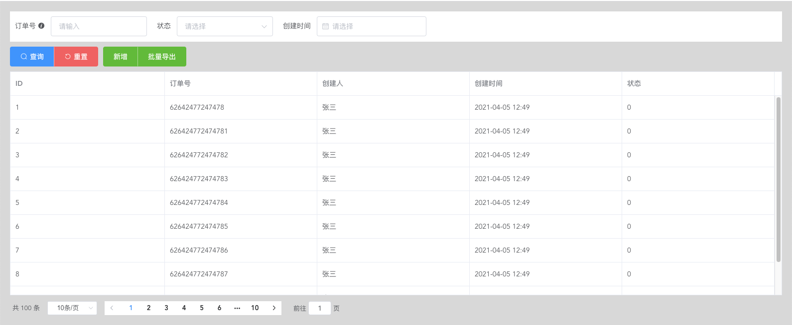

## vue-search-form-table

一个基于element-ui二次封装的table组件，包括表单查询、分页、表格高度自适应滚动。



### 下载
```
npm i @zhanghaibiao/search-form-table --save
```

### 安装

全局安装
```
// main.js
import SearchFormTable from '@zhanghaibiao/search-form-table'
Vue.use(SearchFormTable)
```

局部安装

```
import { SearchFormTable } from '@zhanghaibiao/search-form-table'
components: {
  SearchFormTable
}
```

### example
```
<template>
  <div style="padding: 20px;">
    <search-form-table
      v-model="query"
      :search-form="searchForm"
      :data="tableData"
      :total="total"
      @search="fetchData"
      :loading="loading"
      border>
      <el-button-group slot="button">
        <el-button type="success">新增</el-button>
        <el-button type="success">批量导出</el-button>
      </el-button-group>
      <el-table-column label="ID" prop="id"></el-table-column>
      <el-table-column label="订单号" prop="orderNo"></el-table-column>
      <el-table-column label="创建人" prop="name"></el-table-column>
      <el-table-column label="创建时间" prop="createDate"></el-table-column>
      <el-table-column label="状态" prop="status"></el-table-column>
    </search-form-table>
  </div>
</template>

<script>

export default {
  name: 'App',

  data() {
    return {
      loading: false,
      tableData: [],
      total: 0,
      query: {
        pageIndex: 1,
        pageSize: 10,
        orderNo: '',
        status: null,
        createDate: null
      },
      searchForm: [
        {
          label: '订单号',
          type: 'input',
          key: 'orderNo', // key与query对应
          labelInfo: '这是订单号的输入框'
        },
        {
          label: '状态',
          type: 'select',
          key: 'status',
          options: [
            { label: '待发货', value: 0 },
            { label: '已发货', value: 1 },
            { label: '已收货', value: 2 }
          ],
          filterable: true
        },
        {
          label: '创建时间',
          type: 'date',
          key: 'createDate'
        }
      ]
    }
  },

  mounted() {
    this.fetchData()
  },

  methods: {
    fetchData() {
      this.loading = true
      setTimeout(() => {
        this.tableData = [
          { id: '1', orderNo: '62642477247478', status: 0, name: '张三', createDate: '2021-04-05 12:49' },
          { id: '2', orderNo: '626424772474781', status: 0, name: '张三', createDate: '2021-04-05 12:49' },
          { id: '3', orderNo: '626424772474782', status: 0, name: '张三', createDate: '2021-04-05 12:49' },
          { id: '4', orderNo: '626424772474783', status: 0, name: '张三', createDate: '2021-04-05 12:49' },
          { id: '5', orderNo: '626424772474784', status: 0, name: '张三', createDate: '2021-04-05 12:49' },
          { id: '6', orderNo: '626424772474785', status: 0, name: '张三', createDate: '2021-04-05 12:49' },
          { id: '7', orderNo: '626424772474786', status: 0, name: '张三', createDate: '2021-04-05 12:49' },
          { id: '8', orderNo: '626424772474787', status: 0, name: '张三', createDate: '2021-04-05 12:49' },
          { id: '9', orderNo: '6264247724747866', status: 0, name: '张三', createDate: '2021-04-05 12:49' },
          { id: '10', orderNo: '6264247724747834', status: 0, name: '张三', createDate: '2021-04-05 12:49' }
        ]
        this.total = 100
        this.loading = false
      }, 2000)
    }
  }
}
</script>
```

### 参数说明

|  参数   | 说明  |  类型   | 是否必填  | 默认值  |
|  ----  | ----  |  ----  | ----  |  ----  |
|  value/v-model   | 查询条件对象  |  Object   | 是  |   |
|  search-form   | 表单  |  Array   |  否  |  []  |
|  page-index-key   | 查询条件里的页码key  |  String   |  否  |  pageIndex  |
|  page-size-key   | 查询条件里的每页数量key  |  String   |  否  |  pageSize  |
|  page-sizes   | 每页显示个数选择器的选项设置  |  Number[]   |  否  |  [10, 20, 30, 40, 50, 100]  |
|  total   | 列表总数量  |  Number   |  否  |  0  |
|  hide-pagination   | 隐藏分页  |  Boolean   |  否  |  false  |
|  loading   | 表格显示loading  |  Boolean   |  否  |  false  |
|  form-collapse   | 表单是否开启可折叠  |  Boolean   |  否  |  true  |
|  enable-table-height   | 是否表格高度自适应  |  Boolean   |  否  |  true  |
|  bottom-offset   | 表格距离底部的距离（enable-table-height为true时有效）  |  Number   |  否  |  60  |
|  ui-size   | 组件尺寸大小：medium、small、mini  |  String   |  否  |    |
|  label-width   | form表单的label-width  |  String   |  否  |    |


